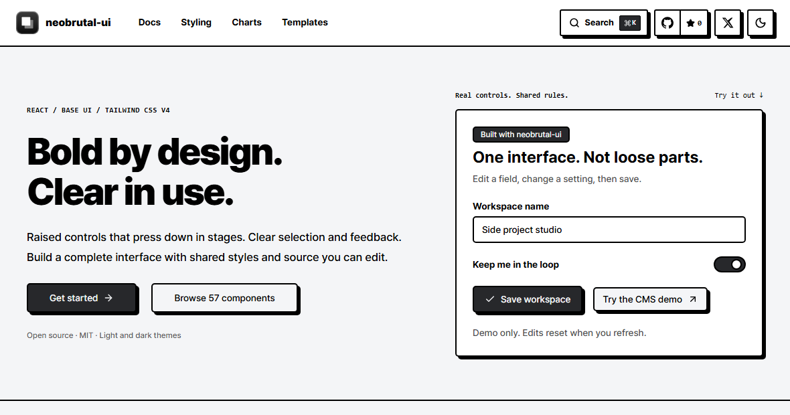

# neobrutal-ui

Neobrutalist React components, themes, and page templates that you install with the shadcn CLI.
The source files are copied into your project, so you can read, edit, and own the code.

[Documentation](https://neobrutal-ui.andongmin.com) ·
[Installation](https://neobrutal-ui.andongmin.com/docs/installation) ·
[Component directory](https://neobrutal-ui.andongmin.com)



## Quick start

Use React 19, Tailwind CSS v4, and an initialized shadcn project.
Choose Base UI if `shadcn init` asks which component library to use.

```bash
npx shadcn@latest init
npx shadcn@latest add https://neobrutal-ui.andongmin.com/r/neobrutal-ui.json
npx shadcn@latest add https://neobrutal-ui.andongmin.com/r/button.json
```

Then render your first component:

```tsx
import { Button } from "@/components/ui/button";

export default function Example() {
  return <Button>Click me</Button>;
}
```

A button with a bold border and hard shadow means the setup worked.
Browse the [component directory](https://neobrutal-ui.andongmin.com) to add more pieces.

## Adding neobrutal-ui to an existing project

The shared base updates project-wide colors, borders, shadows, and global styles.
Commit your current work first, then inspect the base before installing it:

```bash
npx shadcn@latest view https://neobrutal-ui.andongmin.com/r/neobrutal-ui.json
```

## Optional: shorter install commands

Direct URLs work without extra configuration.
To use shorter commands such as `@neobrutal-ui/dialog`, add this entry to the existing
`registries` object in `components.json`:

```json
{
  "registries": {
    "@neobrutal-ui": "https://neobrutal-ui.andongmin.com/r/{name}.json"
  }
}
```

```bash
npx shadcn@latest add @neobrutal-ui/dialog
npx shadcn@latest add @neobrutal-ui/theme-red
```

## Themes and templates

The shared base starts with the yellow theme.
Install one named theme when you want to replace the project-wide light and dark colors.
Page templates target the Next.js App Router; regular UI components support Next.js and Vite.

## About the project

This is an independently maintained derivative of
[ekmas/neobrutalism-components](https://github.com/ekmas/neobrutalism-components), not the
upstream project or an official shadcn project.
It uses Base UI for accessible interaction behavior, Tailwind CSS v4 for styling, and the
shadcn registry format for source-code installation.

## Development

Use Node.js 22.12 or newer within the Node 22 release line and npm.
`format` writes fixes; `lint` only checks files.

```bash
cd registry
npm ci
npm run format
npm run lint
npm run typecheck
npm run build
npm run registry:validate
npm run registry:check
npm run consumer:verify

cd ../docs
npm ci
npm run format
npm run lint
npm run typecheck
npm run build
npm run check:budget
npm test
npx playwright install --with-deps chromium firefox webkit
npm run test:browser
npm run test:browser:cross
```

`registry/src` is the source of truth.
The registry build generates installable JSON and synchronizes the copies used by the docs.
Do not edit generated copies by hand; CI checks that they match their source.

Production verification checks the deployed commit, security headers, registry endpoints,
representative fresh installs, and Chromium, Firefox, and WebKit behavior.

## Repository layout

| Path | Responsibility |
| --- | --- |
| `registry/src` | Component, template, token, and catalog sources |
| `registry/scripts` | Build and installation checks |
| `docs` | Documentation site and live previews |
| `registry/directory-entry.json` | Proposed shadcn directory metadata |

## License and attribution

MIT. Derived from `ekmas/neobrutalism-components`.
The original copyright and license notice is preserved in [LICENSE](LICENSE); retain it when
redistributing derived code.
