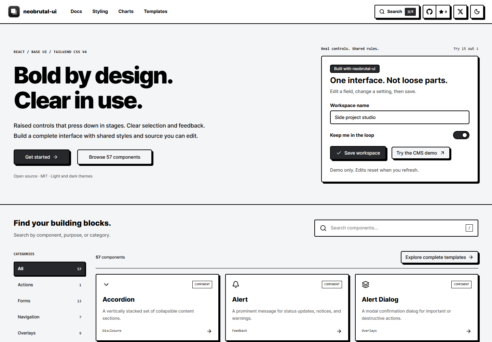
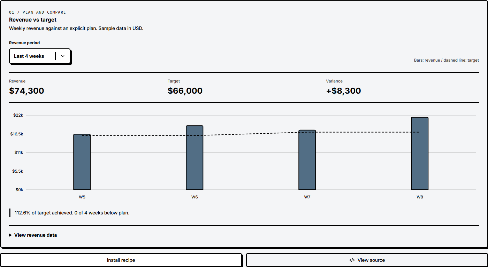
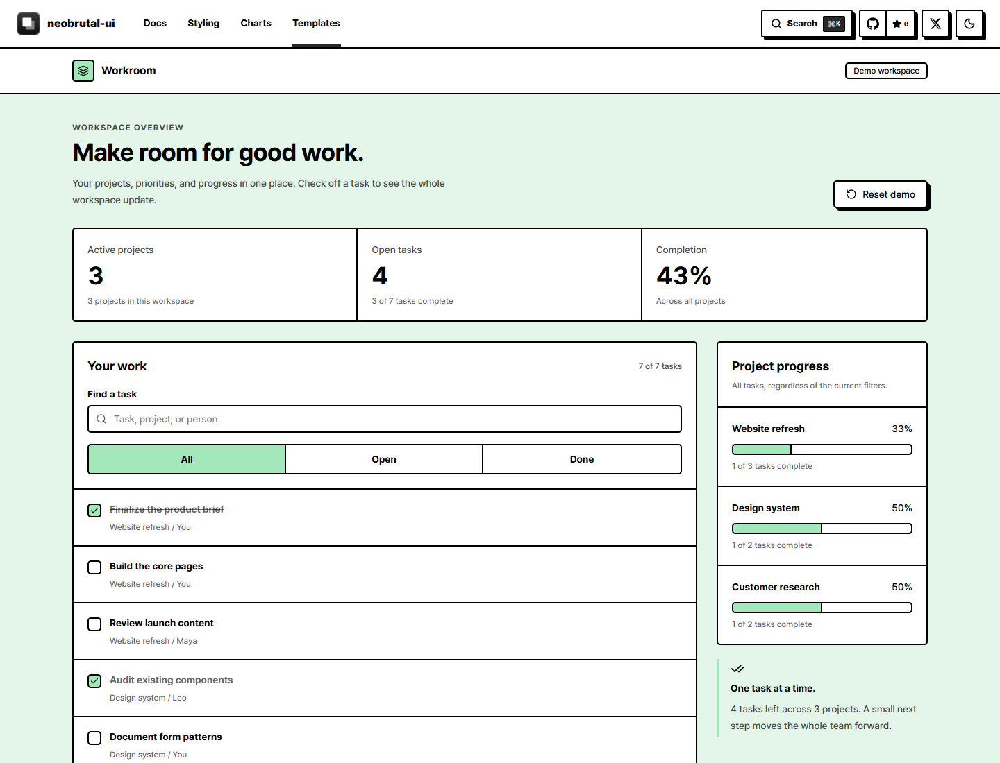
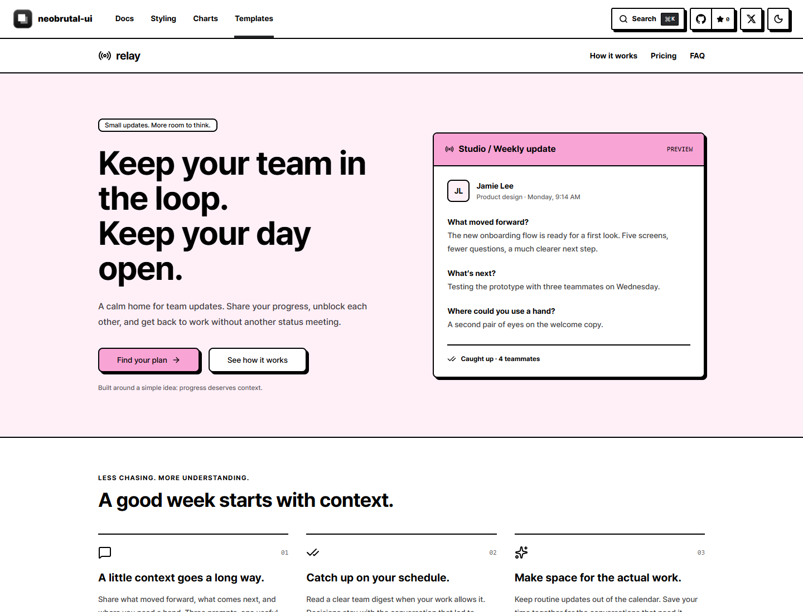
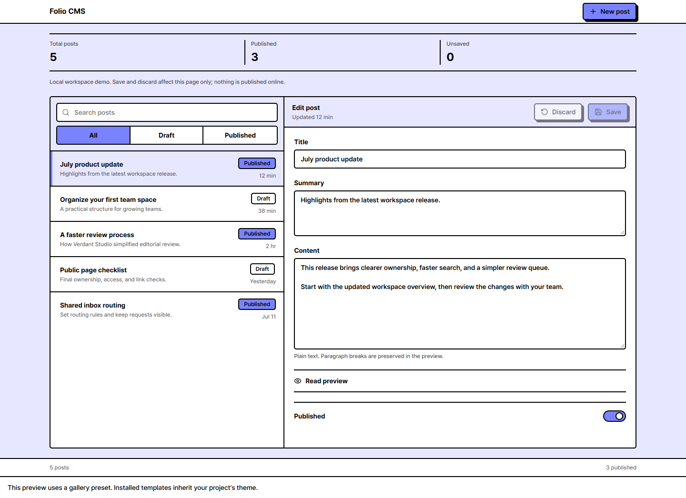
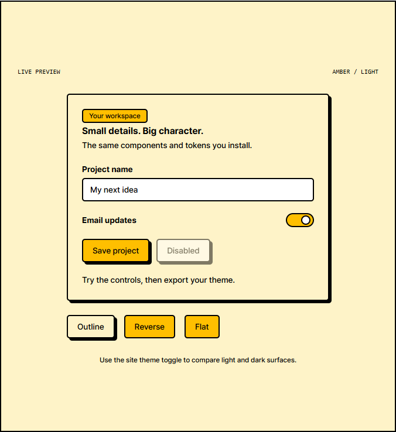
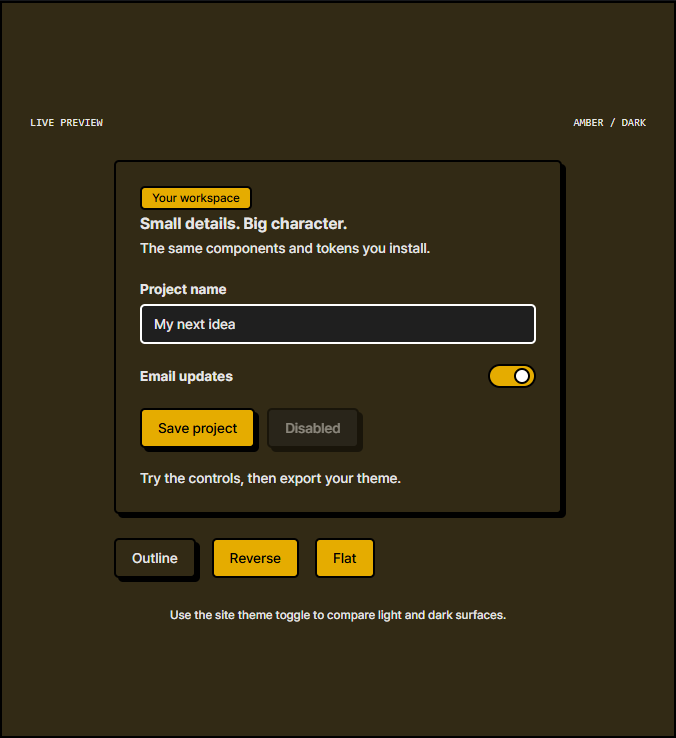

# neobrutal-ui

**React components with bold borders, hard shadows, and buttons that feel pressable.**

[](https://github.com/andongmin94/neobrutal-ui/actions/workflows/ci.yml)
[](LICENSE)

Build a form, a dashboard, or a complete page with **Base UI** and **Tailwind CSS v4**.
Pick the components you need, add them with the shadcn CLI, and make them your own.
The files live in your project, so you can change the styles and behavior directly.

[Get started](https://neobrutal-ui.andongmin.com/docs/installation) ·
[Browse components](https://neobrutal-ui.andongmin.com) ·
[Try the charts](https://neobrutal-ui.andongmin.com/charts) ·
[Explore templates](https://neobrutal-ui.andongmin.com/templates) ·
[Choose a theme](https://neobrutal-ui.andongmin.com/styling)

[](https://neobrutal-ui.andongmin.com)

*Try the form on the [home page](https://neobrutal-ui.andongmin.com), then browse the components below it.
All images in this README are screenshots of the working demos.*

## Add your first component

You'll need **React 19** and **Tailwind CSS v4**. Components and charts work with **Next.js**
and **Vite**. The page templates use the **Next.js App Router**.

### 1. Set up shadcn

From your app's folder, initialize shadcn if you haven't already. Choose **Base UI** when prompted.

```bash
npx shadcn@latest init
```

### 2. Add the styles and a button

Install the shared styles once, then your first component:

```bash
npx shadcn@latest add https://neobrutal-ui.andongmin.com/r/neobrutal-ui.json
npx shadcn@latest add https://neobrutal-ui.andongmin.com/r/button.json --overwrite
```

The first command adds the colors, borders, shadows, and utilities used by the components.
The second replaces the button that shadcn may have created.

> **Already have a customized app?** Commit your work first. The shared styles affect your whole
> app, and `--overwrite` replaces your existing button files. You can inspect the styles with
> `npx shadcn@latest view https://neobrutal-ui.andongmin.com/r/neobrutal-ui.json`.
> You do not need `--overwrite` for every component you add.

### 3. Use it in a page

```tsx
import { Button } from "@/components/ui/button";

export default function Example() {
  return <Button>Click me</Button>;
}
```

You should see a button with a bold border and hard shadow. Hover or press it to see the interaction.
Next, pick a [component](https://neobrutal-ui.andongmin.com) and copy its install command.

The [installation guide](https://neobrutal-ui.andongmin.com/docs/installation) covers existing
projects, custom import paths, and manual installation. Installed files do not update automatically;
review changes before replacing anything you've customized.

## Build a data view

Start with one of eight chart examples for revenue, conversion, service latency, and more.
Each brings together a chart, controls, a summary, and a table for inspecting the exact values.
Replace the sample data in the installed source with your own.

[](https://neobrutal-ui.andongmin.com/docs/chart-revenue-target)

*[Try this chart](https://neobrutal-ui.andongmin.com/docs/chart-revenue-target) or
[browse all charts](https://neobrutal-ui.andongmin.com/charts). The values shown are sample data.*

## Start with a complete page

Choose from six starting points, each with a working demo:

| Template | Start with |
| --- | --- |
| [Dashboard](https://neobrutal-ui.andongmin.com/templates/dashboard) | Task search, status filters, completion controls, and project progress |
| [Product landing](https://neobrutal-ui.andongmin.com/templates/landing) | Feature sections, monthly and yearly pricing, plan selection, and FAQs |
| [Blog](https://neobrutal-ui.andongmin.com/templates/blog) | Searchable posts, topic filters, and reading pages |
| [Portfolio](https://neobrutal-ui.andongmin.com/templates/portfolio) | Project summaries, expandable case studies, and contact links |
| [CMS](https://neobrutal-ui.andongmin.com/templates/cms) | A local post editor with search, preview, save, and discard |
| [Link hub](https://neobrutal-ui.andongmin.com/templates/links) | Grouped links and a copyable contact address |

Explore a demo, then copy its install command from the
[template gallery](https://neobrutal-ui.andongmin.com/templates).

| Dashboard | Product landing |
| --- | --- |
| [](https://neobrutal-ui.andongmin.com/templates/dashboard) | [](https://neobrutal-ui.andongmin.com/templates/landing) |

*Track sample work in the dashboard, or explore the landing page's billing switch, plan selection,
and FAQs. Both are interactive starting points you can adapt to your product.*

[](https://neobrutal-ui.andongmin.com/templates/cms)

*The CMS is a local UI example. Edits reset on refresh; connect your own data and save logic for
an application. Gallery colors are for demonstration: installed templates use your app's theme.*

Dashboard changes also stay in the current page. Landing-page plan selection demonstrates the UI;
it does not create an account or take a payment. Replace the sample content and connect your own
application logic when you use these templates.

## Make it yours

Start with the default **Mono** theme, or choose **Mono Warm** or a color preset.
Use the [styling playground](https://neobrutal-ui.andongmin.com/styling) to adjust colors,
corner radius, and shadows while trying the real controls. Copy the generated CSS when you're happy
with the result.

| Amber · light | Amber · dark |
| --- | --- |
| [](https://neobrutal-ui.andongmin.com/styling) | [](https://neobrutal-ui.andongmin.com/styling) |

*The same components in both modes. Every preset includes light and dark colors;
your app controls which mode is active.*

## Optional: shorter install commands

<details>
<summary>Use names such as @neobrutal-ui/dialog instead of full URLs</summary>

Merge this entry into the existing `registries` object in `components.json`:

```json
{
  "registries": {
    "@neobrutal-ui": "https://neobrutal-ui.andongmin.com/r/{name}.json"
  }
}
```

Then install by name:

```bash
npx shadcn@latest add @neobrutal-ui/dialog
npx shadcn@latest add @neobrutal-ui/theme-mono-warm
```

</details>

## Work on this project

<details>
<summary>Run the documentation locally and contribute</summary>

Use Node.js 24+ and npm:

```bash
git clone https://github.com/andongmin94/neobrutal-ui.git
cd neobrutal-ui
npm ci --prefix registry
npm ci --prefix docs
npm run build --prefix registry
npm run dev --prefix docs
```

Edit installable components, templates, tokens, and catalog data in `registry/src`. Build the
registry before working on docs: it generates installation files and synchronizes the docs app.
Do not hand-edit generated copies.

Documentation lives in `docs/content`, interactive examples in `docs/src/examples`, and the
site UI in `docs/src/site`. Update a component's examples and documentation alongside its source.
See [AGENTS.md](AGENTS.md) for conventions, [QUALITY.md](QUALITY.md) for release checks, and
[the CI workflow](.github/workflows/ci.yml) for the complete verification sequence.

</details>

Found a bug? [Open an issue](https://github.com/andongmin94/neobrutal-ui/issues) with your framework,
steps to reproduce it, and a small code example.

## License

[MIT](LICENSE). Keep the copyright and permission notices with redistributed copies.
